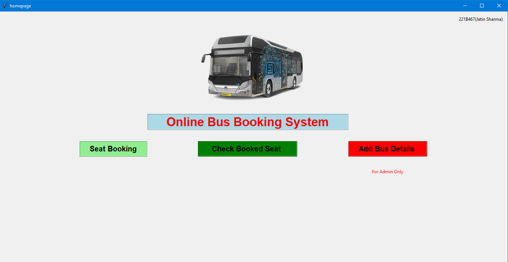
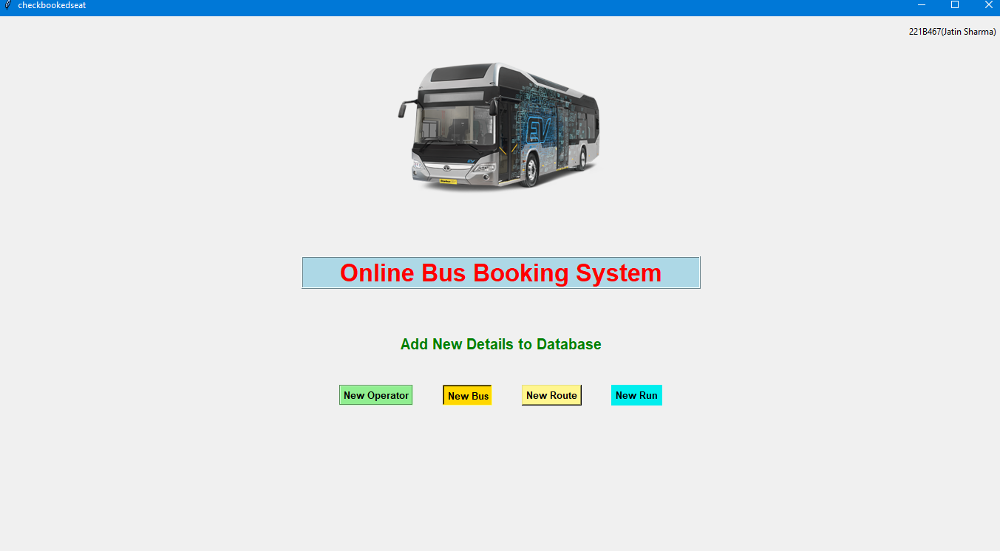

Here's a well-structured `README.md` for your bus booking system project, showcasing key features, functionality, and how to run the project:

---

# Bus Booking System

### A Python Tkinter-based application for managing bus routes, operators, and booking tickets.

## Table of Contents
- [Introduction](#introduction)
- [Features](#features)
- [Installation](#installation)
- [Usage](#usage)
- [Screenshots](#screenshots)
- [Video Demo](#video-demo)
- [File Structure](#file-structure)
- [Contributing](#contributing)
- [License](#license)

## Introduction
This project is a **Bus Booking System** developed using **Python Tkinter** for the graphical user interface (GUI) and **SQLite** for the database. The application allows users to manage buses, routes, and operators, book tickets, and view booked seats.

It's a great learning project to understand how GUIs work in Python and how to integrate them with databases for real-world applications.

## Features
- **User-friendly GUI** for managing buses, operators, routes, and bookings.
- **Database-backed storage** using SQLite for storing bus schedules, routes, operators, and booking information.
- **Ticket booking functionality**, including viewing and managing seat availability.
- **Separate admin interface** for adding new buses, routes, and operators.
- **Interactive front page** and smooth navigation between screens.


## Usage
### Running the Application:
1. **Homepage**: Run `frontpage_first_screeen_open_this.py` to access the homepage.
2. **Admin Panel**: Use `admin_use.py` to manage buses, routes, and operators.
3. **Book a Bus**: Run `bookbus.py` to start booking tickets.
4. **View Booked Seats**: Use `checkbookseat.py` to check seat availability.
5. **Other Modules**:
   - `newbus.py` – Add a new bus to the database.
   - `newop.py` – Add a new operator.
   - `newroute.py` – Add new routes.
   - `newrun.py` – Manage bus runs.

### Admin Functions:
- Add, delete, or update buses, routes, and operators.
- Manage bus schedules and track routes.

### User Functions:
- Book bus tickets by selecting routes and available seats.
- View seat availability for a selected bus.

## Screenshots
*Screenshots showcasing the GUI and various features of the system.*



## Video Demo
*Watch the complete walkthrough of the project:*

[Video Link Here](#)

## File Structure
```
|-- admin_use.py           # Admin panel for managing buses, routes, and operators
|-- bookbus.py             # Main file for booking a bus
|-- bus.png                # Image used in the UI
|-- bus_booking_system.py   # Main application file
|-- checkbookseat.py       # Module to check booked seats
|-- frontpage_first_screeen_open_this.py   # Front page GUI
|-- homelogo.png           # Logo used in the homepage
|-- homepage.py            # Homepage logic
|-- newbus.py              # Module to add new buses
|-- newop.py               # Module to add new operators
|-- newroute.py            # Module to add new routes
|-- newrun.py              # Module to manage bus runs
|-- show_ticket.py         # Module to display booked tickets
|-- README.md              # Documentation
```

## Contributing
Contributions are welcome! Feel free to submit a pull request with any improvements or features you'd like to see.


